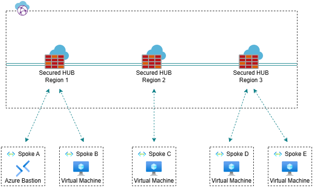

# Azure Bastion as a Shared Service (Secured HUB approach)

## Introduction

Let's imagine you have a lot ot virtual machines in Azure and want to connect them in a secure way, without exposing them Internet, what service do you need to use? Of course Azure Bastion.
Now, let's imagine you have different workloads (landing zones) in different virtual networks and subscriptions with different product teams, are going to deploy Azure Bastion per subscription? Of course, this is also possible, but since this resource is quite expensive, we should think to make it as a shared service.

Today's focus will be integration Azure Bastion Azure Virtual WAN (Secured HUB and spoke) approach.

## Prerequisites

- Deploy Spoke Virtual Network for the Azure Bastion, since it isn't possible to integrate into Virtual HUB.
- Deploy Azure Bastion into Virtual Network with enabling "IP-based connection" feature, this feature provides possibility to connect Virtual Machines from peered virtual networks and on-premises.
- Create peering from Virtual HUB to Azure Bastion's spoke virtual network.

After completing all prerequisites, you will not be able to connect Virtual Machines via Azure Bastion due to limitation. Azure Bastion requires to have Internet Connectivity, but Routing Intent Feature sends all traffic, including private and public from the spoke Virtual Network to Azure Firewall.

> **_NOTE:_**  "UDR isn't supported on Bastion subnet, including with IP-based connection."

## Steps to make it work

## Refferences

- <https://learn.microsoft.com/en-us/azure/bastion/bastion-overview>
- <https://learn.microsoft.com/en-us/azure/bastion/connect-ip-address>
