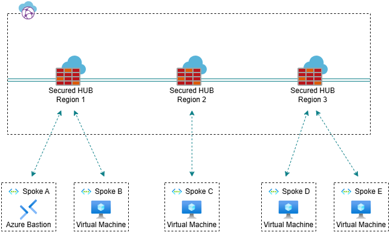
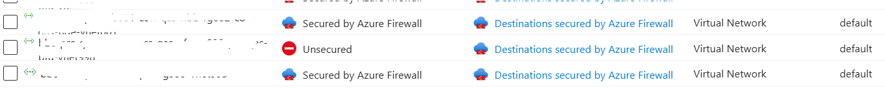

# Azure Bastion as a Shared Service (Secured Hub approach)

## Introduction

Let’s imagine you have a lot of virtual machines in Azure and want to connect to them securely, without exposing them to the internet. What service should you use? Of course, Azure Bastion.

Now, let’s imagine you have different workloads (landing zones) across various virtual networks and subscriptions, managed by different product teams. Are you going to deploy Azure Bastion in each subscription? Of course this is possible, but do not forget that this resource is quite expensive, so it makes sense to consider using it as a shared service.

Today’s focus will be on integrating Azure Bastion with Azure Virtual WAN using the secured hub-and-spoke approach.

## Prerequisites

- Deploy a spoke virtual network for Azure Bastion, as it cannot be integrated into a Virtual Hub.
- Deploy Azure Bastion in the virtual network with the "IP-based connection" feature enabled. This feature allows you to connect to virtual machines in peered virtual networks and from on-premises environments.
- Create a peering connection from the Virtual Hub to the spoke virtual network where Azure Bastion is deployed.

After completing all prerequisites, you will not be able to connect to Virtual Machines via Azure Bastion. Azure Bastion requires the next hop for public traffic to be set to the Internet, without routing it through the secured hub. However, the Routing Intent feature sends all traffic (private and public) from the spoke virtual network to the Azure Firewall by default. Due to a current limitation, you cannot use a User Defined Route (UDR) to override the route for the Azure Bastion subnet.

> **_NOTE:_**  "UDR isn't supported on Bastion subnet, including with IP-based connection."

## Steps to make it work

- Open Azure Firewall Manager
- Go to "Security Configuration" in the Hub
- Find the Azure Bastion virtual network connection and select it
- Click on "Remove Internet Security" - after a few minutes, you will see the following result (see in the image)

Now, you can connect to virtual machines via Azure Bastion after allowing connections from the Azure Bastion subnet to the virtual machine subnets in Azure Firewall. This architecture allows you to connect to virtual machines across different regions, but you can also deploy Azure Bastion in each region, but you will need to repeat all the steps for every region.

## Refferences

- <https://learn.microsoft.com/en-us/azure/bastion/bastion-overview>
- <https://learn.microsoft.com/en-us/azure/virtual-wan/virtual-wan-about>
- <https://learn.microsoft.com/en-us/azure/firewall-manager/secured-virtual-hub>
- <https://learn.microsoft.com/en-us/azure/bastion/connect-ip-address>
