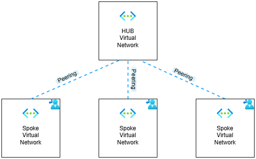
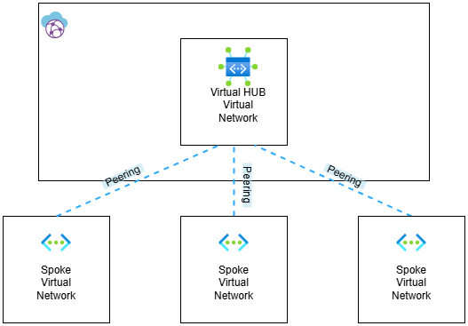

# Azure Network Topology

## What is the network topology?

Network topology describes how various devices or locations are interconnected with one another. There are several types of topologies, including Point-to-Point, Bus, Ring, Star, Tree, and Mesh.

Since today's topic is Azure, and the Azure Cloud Adoption Framework (CAF) offers us only Hub and Spoke when discussing topologies, our main focus will be on the Star topology, also known as Hub and Spoke.

## Why is it so crucial to pick the correct topology?

Choosing the right network topology is key because it affects how well your network performs, how easily it can grow, how reliable it is, and how much it costs to set up and maintain. The right structure keeps data flowing smoothly, prevents downtime, and saves money long-term.

## Options in Azure

- Traditional Azure networking topology
- Virtual WAN network topology

***Traditional Azure networking topology***

With traditional network topology in azure is meaning that we use one Virtual Network as a Hub and all other virtual networks for landing zones are connected to it as a spokes.

- Pros, the custom virtual network give us flexibility to manage subnets of the hub or add multiple Ip address prefix in the virtual network.
- Pros, it is possible to integrate different resources into virtual network (virtual machines, bastion, private dns resolver, app gateway).
- Pros, Virtual network has no any built-in router, so it means there is no any bandwidth limitation unless we implement some 3rd party network virtual appliance (For Azure Firewall Premium SKU we can increaset bandwith up to 200 GBPS).
- Cons, complicated routing capabilities.
- Cons, in order to get transit connectivity between virtual networks, we need to integrate vpn gateway, azure firewall or 3rd party network virtual appliance in the hub.

***Virtual WAN network topology***

Azure Offers manage hub and spoke solution in the resource Virtual WAN, where the central connectivity point is virtual hub and spoke virtual networks are connected to it.

- Pros, easy to manage, since everything is combined in virtual wan resource.
- Pros, simplified routing capabilities.
- Pros, Azure Virtual WAN's built-in Gateway's offer higher bandwidth than traditional Virtual Network Gateway. It also offers to use Azure Virtual WAN for more than 100 S2S tunnels.
- Pros, Azure gives us opportunity to easily integrate 3rd party NVA's into virtual hub, this is quite useful if you already have existing sd-wan solutions for interconnecting different locations.
- Pros, Route-Maps feature is available (public preview) only in virtual wan resource, this feature gives us opportunity summarize, control and manage routes from on-premise and virtual networks.  Modify BGP attribute such as AS-PATH to make a route more, or less preferable.
- Cons, The spoke virtual network can not contain any type of Gateway.
- Cons, Each hub has same BGP AS Number, that can be problem for some redundancy scenario.
- Cons, we can't use DDOS protection standard plan, since it is not possible activate it into hub.
- Cons, Private DNS Zones can not be linked to the virtual hub, you need to create spoke virtual network for dns.
- Cons, Azure resources like Application Gateway, Azure Bastion can not be integrated to virtual hub directly, you need to set up spoke virtual network for them.

Note: Using new resources called Azure Virtual Network Manager we also can to set up mesh network topology. We can't use this resource with Virtual WAN resource.

### Conclusion

A traditional Virtual Network as a hub provides greater flexibility, especially if you have strong networking skills. With this approach, you can implement various routing scenarios.
The Virtual WAN resource is particularly useful for multi-region setups, especially if you already have an on-premises SD-WAN solution. It allows you to easily extend your cloud network infrastructure as an SD-WAN branch.
Choosing the right topology is a personal decision and should be designed to meet your specific needs. You can consider my personal thoughts, but it’s always better to test everything thoroughly before deploying it in production.
This article was written on November 22, 2024, so new features might be available for both options by now.

### References

- <https://learn.microsoft.com/en-us/azure/cloud-adoption-framework/ready/azure-best-practices/define-an-azure-network-topology>
- <https://learn.microsoft.com/en-us/azure/virtual-wan/whats-new>
