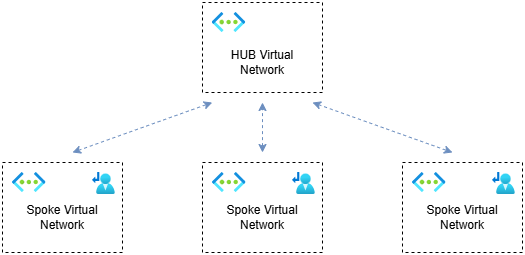
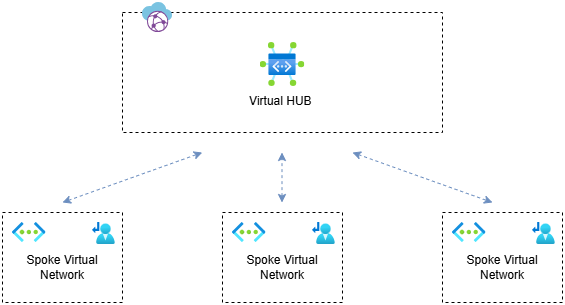

# Azure Network Topology

## What is Network Topology?

Network topology defines how various devices or locations are interconnected. There are several types of topologies, including Point-to-Point, Bus, Ring, Star, Tree, and Mesh.

Since our topic is Azure, and the Azure Cloud Adoption Framework (CAF) primarily focuses on the Hub-and-Spoke model when discussing topologies, our main focus will be on the Star topology, commonly known as Hub-and-Spoke in Azure.

## Why is it crucial to choose the right topology?

Selecting the right network topology is essential because it impacts performance, scalability, reliability, and cost-efficiency. A well-designed topology ensures smooth data flow, minimizes downtime, and reduces long-term expenses for setup and maintenance.

## Options in Azure

- Traditional Azure Networking Topology
- Virtual WAN Network Topology

***Traditional Azure Networking Topology***

In a traditional Network Topology in Azure, one Virtual Network serves as the Hub, while all other Virtual Networks, used as landing zones, are connected to it as Spokes.

Pros:

- The custom Virtual Network provides flexibility to manage subnets within the Hub and add multiple IP address prefixes to the virtual network.
- It is possible to integrate various resources into the Virtual Network (such as Virtual Machines, Azure Bastion, Private DNS Resolver, and Azure Application Gateway).
- The Virtual Network does not have a built-in router, meaning there are no bandwidth limitations unless we implement a third-party Network Virtual Appliance. (For the Azure Firewall Premium SKU, we can increase bandwidth up to 100 Gbps)

Cons:

- Complicated routing capabilities.
- To achieve transit connectivity between Virtual Networks, we need to integrate a VPN Gateway, Azure Firewall, or a third-party Network Virtual Appliance in the Hub.

***Virtual WAN network topology***

Azure Offers manage hub and spoke solution in the resource Virtual WAN, where the central connectivity point is Virtual Hub and spoke Virtual Networks are connected to it.

Pros:

- Easy to manage since everything is combined within the Virtual WAN resource.
Simplified routing capabilities.
- Azure Virtual WAN's built-in gateways offer higher bandwidth than traditional Virtual Network Gateways. It also allows using Azure Virtual WAN for more than 100 S2S tunnels.
- Azure provides the ability to easily integrate third-party NVAs into the virtual hub, which is particularly useful if you already have existing SD-WAN solutions for interconnecting different locations.
- The Route Maps feature is available only in Virtual WAN. This feature allows summarizing, controlling, and managing routes from on-premises and Virtual Networks. It also enables modifying BGP attributes such as AS-PATH to make a route more or less preferable.

Cons:

- The spoke Virtual Network cannot contain any type of Gateway.
- Each hub has the same BGP AS Number, which can be problematic for some redundancy scenarios.
- DDoS Protection Standard cannot be used, as it is not possible to activate it in the hub.
- Private DNS Zones cannot be linked to the virtual hub; you need to create a spoke Virtual Network for DNS.
- Azure resources such as Application Gateway and Azure Bastion cannot be directly integrated into the virtual hub; instead, you must set up a spoke Virtual Network for them.

Note: Using new resources called Azure Virtual Network Manager we also can to set up mesh network topology. We can't use this resource with Virtual WAN resource.

### Conclusion

A traditional Virtual Network as a Hub provides greater flexibility, especially if you have strong networking skills. With this approach, you can implement various routing scenarios.
The Virtual WAN resource is particularly useful for multi-region setups, especially if you already have an on-premises SD-WAN solution. It allows you to easily extend your Cloud Network Infrastructure as an SD-WAN branch.
Choosing the right topology is a personal decision and should be designed to meet your specific needs. You can consider my personal thoughts, but it’s always better to test everything thoroughly before deploying it in production.
This article was written on November 22, 2024, so new features might be available for both options by now.

### References

- <https://learn.microsoft.com/en-us/azure/cloud-adoption-framework/ready/azure-best-practices/define-an-azure-network-topology>
- <https://learn.microsoft.com/en-us/azure/virtual-wan/whats-new>
